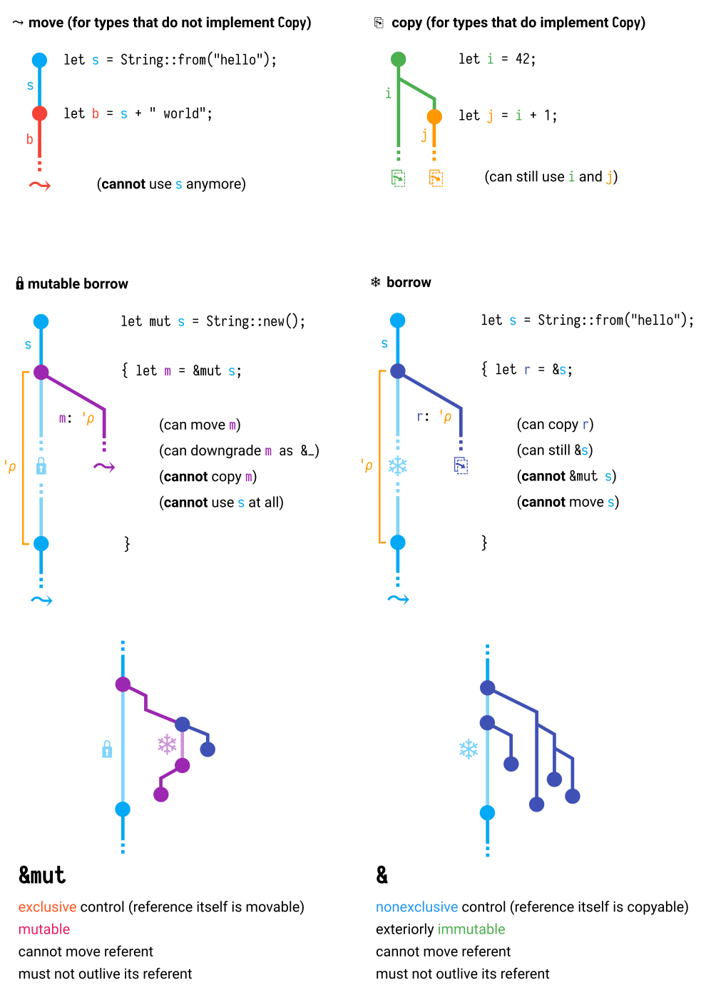

# 无GC的自动内存管理 - Rust实现
## Rust简介 [官网][rust-lang]

- performance [techpower][techpower]
- reliability
- productivity

## Rust基础

- 基础类型 primitive types

```rust
let i: i32 = 1;    // u8, i8, i16, u16, i32, u32, i64, u64
                   // i128, u128, isize, usize
let f: f32 = 0.2f32;
let b: bool = true;
let c: char = '你';
let s: &str = "hello, world";
let a: [u8; 3] = [1, 2, 3];
```
- 可变性 mutablity

```rust
let mut a = 5;
a = 10;
```

- 类型推断 type inference

```rust
let i = true;  // infer bool
let mut list = Vec::new();
list.push(1);  // infer list Vec<i32>
```

- 变量遮蔽 shadowing

```rust
let mut s: String = String::from("hello");
s.push_str(", world");
let s = s;
println!("string is: {}", s);
```

- 元组 tuple

```rust
let t = (1_i32, bool, "hello, world");
println!("({}, {}, {})", t.0, t.1, t.2);
```

- 结构体 struct

```rust
struct Book {
	name: String,
	price: f32,
}
struct RGB(i32, i32, i32);
```

- 类型别名 type alias

```rust
type Uid = u64
let uid: Uid = 1u64;
type IntList = Vec<i32>;
let ilist = vec![1,2,3,4,5];
```

- 枚举 enum

```rust
enum JsValue {
	JsNull,
	JsBool(bool),
	JsNumber(f64),
	JsString(String),
	JsObject(Vec<(String, JsValue)>),
	JsArray(Vec<JsValue>),
}
```

- 模式匹配 pattern matching

```rust
fn test_js_value(value: JsValue) {
	match value {
		JsValue::JsNull => println!("found null"),
		JsValue::JsBool(b) => println!("found bool: {}", b),
		_ => println!("found other"),
	}
}
```

- 特质 trait

```rust
trait Counter {
	fn increment(&mut self) -> i32;
}

struct MyCounter(i32);

impl Counter for MyCounter {
	fn increment(&mut self) -> i32 {
		self.0 += 1;
		self.0
	}
}
let mut mc = MyCounter(0);
println!("{}, {}", mc.increment(), mc.increment());
```

- 函数 function

```rust
fn add_one(input: i32) -> i32 {
	input + 1
}
```

- 方法 method

```rust
struct User {
	name: String,
	hello_count: i32,
}

impl User {
	fn new(name: &str) -> Self {
		User{ name: name.into(), hello_count: 0 }
	}
	
	fn greeting(&self) -> String {
		format!("hello, I am {}", self.name)
	}

	fn say_hello(&mut self) {
		println!("{}", self.greeting());
		self.hello_count += 1;
	}
}

let mut john = User::new("John");
john.say_hello();
```

- 闭包 closure

```rust
let closure = |x| x + 1;
println!("{}", closure(10));
```

- 控制流 control flow

```rust
let i = 0;
if i < 10 {
	println!("small");
} else {
	println!("large");
}

for i in 0..10 {
	println!("{}", i);
}

let list = vec![10,20,30,40,50];
for (idx, elem) in list.iter().enumerate() {
	println!("{}: {}", idx, *elem);
}

loop {
	println!("run forever");
}

let mut i = 0;
while i < 10 {
	println!("{}", i);
	i += 1;
}
```

- 运算符

```rust
// + - * / % & | && || !
```
- 引用/借用 reference/borrow
```rust
fn populate(list: &mut Vec<i32>) {
	for i in 0..10 {
		list.push(i);
	}
}

let mut list = Vec::new();
populate(&mut list);
println!("{:?}", list);

for elem in &mut list {
	*elem *= 10;
}
println!("{:?}", list);
```

- 泛型 generics

```rust
enum Result<R, E> {
	Success(R),
	Error(E),
}

struct HashMap<K, V> where K: Hash + Eq {
	// internal fields...
}

trait Comparator<T> {
	fn less(&self, left: T, right: T) -> bool; 
}
```

- 关联类型 associated type

```rust
trait Future {
	type Item;
	type Error;

	fn poll(&mut self) -> Result<Option<Self::Item>, Self::Error>;
}
```

- 宏 macro

```rust
println!("{}", vec![1,2,3]);
assert_eq!(10, 1+9);

macro_rules! myvec {
    ($($v:expr),*) => {
        {
            let mut temp = Vec::new();
            $(
                temp.push($v);
            )*
            temp
        }
    };
}

// and more powerful proc_macros not introduced here
```

## 内存安全

- 空指针 null pointer

- 野指针 dangling pointer

- 非法释放 double free

- 数据竞争 data race

## Rust的承诺

- 简单的测试

```rust
// null pointer
let p: &i32;
println!("{}", *p); // error! borrow of possibly uninitialized variable: `p`

// dangling pointer
let mut list = Vec::with_capacity(1);
list.push(1);
let first = &list[0];
list.push(2); // error! cannot borrow `list` as mutable because it is also borrowed as immutable
println!("{}", *first);

// double free
let list = vec![1,2,3];
drop(list);
drop(list); // error! use of moved value: `list`

// data race
let mut list: vec![1,2,3];
for i in &list {
	println!("{}", i);
	if *i == 2 {
		list.clear(); // error! cannot borrow `list` as mutable because it is also borrowed as immutable
	}
}
```

- 核心原则：共享(aliasing)不可变(mutability)，可变不共享。

- 所有权(ownership)与生命周期(lifetime)

Move语义：Rust的赋值表达式的默认语义

```rust
fn consume(ls: Vec<i32>) {
	println!("{:?}", ls);
}
let list = Vec::<i32>::new();  // 创建Vec对象并赋予list变量
let list2 = list;  // 将list的所有权转移给list2，list的生命周期结束。
consume(list);  // 编译错误：use of moved value: `list`
```

Copy语义：所有实现了Copy trait的类型。

```rust
fn consume(x: i32) {
	println!("{:?}", x);
}
let i = 10;
let j = i;  // i拷贝自身，赋予j
consume(i);  // i仍然可以访问
```

生命周期：当一个变量离开其作用域，其持有的资源被自动释放。

OBRM或RAII设计模式：基于所有权的资源管理。

为了获取资源，创建一个对象来管理它。
要释放资源时，通过删除该对象来清理资源。
内存管理只是资源管理中的一种。像线程，文件，套接字也都可以通过这种方式管理。

```rust
struct Holder(String);
// Drop trait是一个提供析构前回调功能的接口
impl Drop for Holder {
	fn drop(&mut self) {
		println!("{} dropped", self.0);
	}
}
fn main() {
	let h1 = Holder("hello".to_string());
	{
		let h2 = Holder("world".to_string());
	}  // <- h2 out of the scope, print "world dropped"
}  // <- h1 out of the scope, print "hello dropped"
```

- 引用(reference)与借用(borrowing)

除了所有权转移，还可以临时借用，借用不会影响资源的释放。

```rust
struct Holder(String);
fn use_ref(hr: &Holder) {
	println!("borrowed: {}", hr.0);
}

let holder = Holder("hello, world".to_string());
use_ref(&holder);
println!("{}", holder.0);
```

借用不可以存活长于所有者

```rust
#[derive(Debug)]
struct S {};
let mut a: &S;
{
	let b = S{};
	a = &b;  // error! `b` does not live long enough
}
println!("{:?}", a);  // use a here, so a must be alive until this line

```

编译器必须确保该原则，所有违反该原则的都会产生编译错误。这个机制被称作borrow checker。

lifetime elision rules

复杂情况下，需要手动标注生命周期。

```rust
struct Something {}

fn first_elem(ls: &Vec<Something>) -> Option<&Something> {
	if ls.len() > 0 {
		Some(&ls[0])
	} else {
		None
	}
}
// identical function as above
fn first_elem_annotated<'a>(ls: &'a Vec<Something>) -> Option<&'a Something> {
	if ls.len() > 0 {
		Some(&ls[0])
	} else {
		None
	}
}
// how to annotate lifetime?
fn longer_str(s1: &str, s2: &str) -> &str {
	if s1.len() > s2.len() {
		s1
	} else {
		s2
	}
}
```

存在两种引用/借用。
不可变引用(&T)与可变引用(&mut T)。
不可变引用与可变引用的检查规则和读写锁相似：
1. 不能同时存在不可变引用和可变引用
2. 不能同时存在多个可变引用 
3. 在没有可变引用情况下，可以存在多个不可变引用

```rust
let mut list = vec![1,2,3];
let r1 = &mut list;
let r2 = &list; // error! cannot borrow `list` as immutable because it is also borrowed as mutable
r1.push(4);
```

NLL（non-lexical lifetime）为开发人员提供了更好的体验。

```rust
let mut list = vec![1,2,3];
let r1 = &mut list;  // actually not used after this line, could be ended
let r2 = &list;
println!("{}", r2); // compile succeed
```

图示 - Rust的copy，move和borrow




- 智能指针(smart pointer)

1. Box: 把对象放到堆上,并独占该对象的所有权
```rust
let boxed_str = Box::new(String::from("hello"));
fn print_str(s: &String) {
	println!("{}", s);
}
fn consume_str(s: String) {
	// do nothing
}
print_str(&*boxed_str);
consume_str(*boxed_str);
```

2. Rc: 引用计数，提供多个指针指向相同对象，当引用计数降低到0时释放资源
```rust
struct PrintDrop {
	name: String,
};
impl Drop for PrintDrop {
	fn drop(&mut self) {
		println!("dropping {}", self.name);
	}
}

use std::rc::Rc;
let rc_str = Rc::new(PrintDrop{name: String::from("hello")});
{
	let rc_str_copy = Rc::clone(&rc_str);  // increment reference count by 1
}  // <- decrease reference count by 1
// <-- reference count reach to 0, release resource, print "dropping hello"
```

3. Cell: 内部可变性的实现，提供内部对象的整体更新

```rust
fn print_str(s: &String) {
	println!("{}", s);
}
use std::cell::Cell;
let cell_str = Cell::new(String::from("hello"));
cell_str.set(String::from("world"));
let owned_str = cell_str.into_inner(); // move string out of cell
// only those impl Copy can call cell.get() to get a copy
```

4. RefCell: 内部可变性的实现，将编译时的borrow checker延迟到运行时
```rust
fn print_str(s: &String) {
	println!("{}", s);
}
use std::cell::RefCell;
let refcell_str = RefCell::new(String::from("hello"));
refcell_str.borrow_mut().push_str(", world");
print_str(&*refcell_str.borrow());

let mut borrowed_mut_ref = refcell_str.borrow_mut(); // variable hold the mutable ref until the end of scope
borrowed_mut_ref.push_str("!!!");
print_str(&*refcell_str.borrow()); // runtime panic! already mutably borrowed
```

- 内部可变性(interior mutability)

当逻辑上不可变的方法的实现细节又要求某部分成员变量具有可变形的时候，我们可以使用内部可变性。

- 并发编程与线程安全

Send trait：编译器特殊处理，只有实现了Send接口的对象，可以转移到其他线程。

Sync trait：编译器特殊处理，只有实现了Sync接口的对象，可以在线程间共享。(&T实现了Send)

Send/Sync会由编译器根据条件自动实现：
结构体的所有域都实现Send，则该结构体实现Send
结构体的所有欲都实现Sync，则该结构体实现Sync

## 案例学习

实现一个链表（栈）
提供一个默认的构造函数，提供push方法，提供pop方法。

```rust
pub struct List<T> {
	head: Link<T>,
}

type Link<T> = Option<Box<Node<T>>>;

struct Node<T> {
	elem: T,
	next: Link<T>,
}

impl<T> List<T> {
	fn new() -> Self {
		List{head: None}
	}

	fn push(&mut self, elem: T) {
		// try it
		unimplemented!();
	}

	fn pop(&mut self) -> Option<T> {
		// try it
		unimplemented!();
	}
}

impl<T> List<T> {
	fn iter(&self) -> Iter<T> {
		Iter{ next: self.head.map(|boxed_node| &*boxed_node) }
	}
}

struct Iter<T> {
	next: Option<&Node<T>>,
}

impl<T> std::iter::Iterator for Iter<T> {
	type Item = &T;

	fn next(&mut self) -> Option<&T> {

	}
}

#[cfg(test)]
mod test {
	#[test]
	fn test_list() {
		let mut list = List::new();
		list.push(1);
		list.push(2);
		list.push(3);
		assert_eq!(list.pop(), Some(3));
		assert_eq!(list.pop(), Some(2));
		assert_eq!(list.pop(), Some(1));
		assert_eq!(list.pop(), None);
	}

	// advanced test
	#[test]
	fn test_list_iter() {
		let mut list = List::new();
		list.push(1);
		list.push(2);
		list.push(3);
		for i in list.iter() {
			println!("{}", *i);
		}
	}
}

```

## 对其他语言的一些思考

Java
```java
class A {
	private List<Thing> someThings;
	// is this method safe?
	public List<Thing> getSomeThings() { return someThings; }
	// is this method safe?
	public void setSomeThings(List<String> someThings) {
		this.someThings = someThings; 
	}
	// is this method safe?
	public static traverse(Consumer<Thing> f) {
		someThings.forEach(f);
	}
}
```

如何设计一个安全的接口/类？

[rust-lang]: https://www.rust-lang.org/
[techpower]: https://www.techempower.com/benchmarks/#section=data-r17&hw=ph&test=plaintext