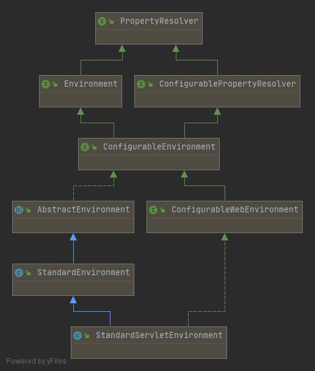
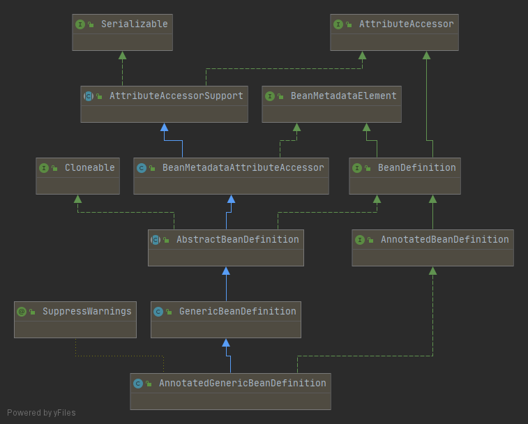
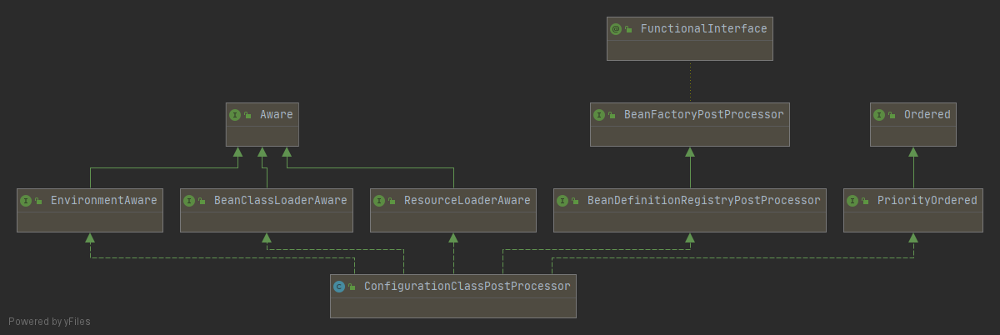
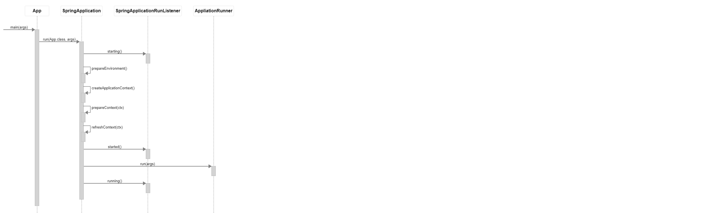
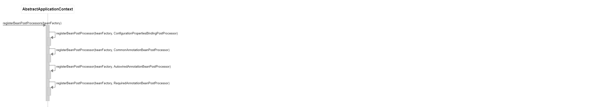
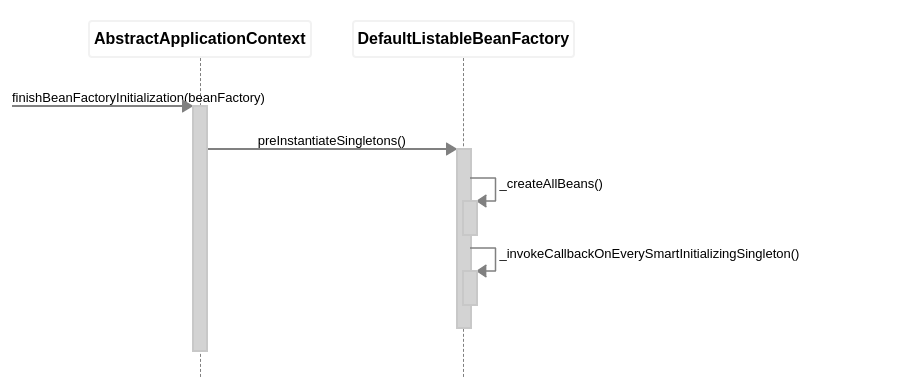

# 聊聊Spring框架

## 对Spring的一些印象

- 强大的IoC容器，非常方便的依赖注入

- 一切都是Bean

- 功能很全，干活很快，拿来主义=引JAR包+配置

- 接口很多，适合

- 源代码很适合阅读：命名规范，结构清晰，注释详尽

## 随手写一个Web服务

```java
@SpringBootApplication
public class App {
    public static void main(String[] args) {
        SpringApplication.run(App.class, args);
    }
}

@RestController
class HelloController {
    @RequestMapping(value = "/hello")
    public ResponseEntity<String> hello() {
        return ResponseEntity.ok("hello, world");
    }
}
```

## 几个问题

1. 配置文件application.yml / application.properties 是通过什么方式加载的？有没有遇到过读不到配置的情况？

2. 依赖注入有几种方式？遇到过NPE么？遇到过循环依赖么？如何解决？

3. 定义Bean的方法是否可以用static关键字修饰？有什么不同？

4. BeanPostProcessor有什么用处？BeanFactoryPostProcessor有什么用处？

5. AutoConfiguration是通过什么机制进行自动配置的？@Conditional*注解是如何判定的？遇到过判定不符合预期的情况么？

6. HttpServletRequest和HttpServletResponse是通过什么方式注入到Controller的方法中的？

7. RestController里方法的返回类型是如何被识别并被转化为HttpResponse的？

8. Spring的事务处理是如何实现的？

9. 如何写一个Spring boot starter？

## 几个概念

1. SpringApplication

2. ApplicationContext


```java
interface ApplicationContext extends EnvironmentCapable, ListableBeanFactory, HierarchicalBeanFactory,
		MessageSource, ApplicationEventPublisher, ResourcePatternResolver {
  String getId();
  String getApplicationName();
  String getDisplayName();
  long getStartupDate();
  ApplicationContext getParent();
  AutowireCapableBeanFactory getAutowireCapableBeanFactory();
}
```

```java
interface ConfigurableApplicationContext extends ApplicationContext, Lifecycle, Closeable {
  void setId(String id);
  void setParent(@Nullable ApplicationContext parent);
  void setEnvironment(ConfigurableEnvironment environment);
  ConfigurableEnvironment getEnvironment();
  void addBeanFactoryPostProcessor(BeanFactoryPostProcessor postProcessor);
  void addApplicationListener(ApplicationListener<?> listener);
  void addProtocolResolver(ProtocolResolver resolver);
  void refresh();
  void registerShutdownHook();
  void close();
  boolean isActive();
  ConfigurableListableBeanFactory getBeanFactory();
}
```

3. Environment & PropertySources



```java
interface PropertyResolver {
  boolean containsProperty(String key);
  String getProperty(String key);
  String getProperty(String key, String defaultValue);
  <T> T getProperty(String key, Class<T> targetType);
  <T> T getProperty(String key, Class<T> targetType, T defaultValue);
  String getRequiredProperty(String key);
  <T> T getRequiredProperty(String key, Class<T> targetType);
  String resolvePlaceholders(String text);
  String resolveRequiredPlaceholders(String text);
}
```

```java
interface Environment extends PropertyResolver {
  String[] getActiveProfiles();
  String[] getDefaultProfiles();
  boolean acceptsProfiles(String... profiles);
}
```

```java
interface ConfigurableEnvironment extends Environment, ConfigurablePropertyResolver {
  void setActiveProfiles(String... profiles);
  void addActiveProfile(String profile);
  void setDefaultProfiles(String... profiles);
  MutablePropertySources getPropertySources();
  Map<String, Object> getSystemProperties();
  Map<String, Object> getSystemEnvironment();
  void merge(ConfigurableEnvironment parent);
}
```

```java
interface PropertySources extends Iterable<PropertySource<?>> {
  boolean contains(String name);
  PropertySource<?> get(String name);
}
```

```java
abstract class PropertySource<T> {
  public String getName();
  public T getSource();
  public boolean containsProperty(String name);
  public abstract Object getProperty(String name);
}
```

4. Bean & BeanDefinition & AnnotationMetadata



```java
interface BeanDefinition extends AttributeAccessor, BeanMetadataElement {
  void setParentName(@Nullable String parentName);
  String getParentName();
  void setBeanClassName(@Nullable String beanClassName);
  String getBeanClassName();
  void setScope(@Nullable String scope);
  String getScope();
  void setLazyInit(boolean lazyInit);
  boolean isLazyInit();
  void setDependsOn(@Nullable String... dependsOn);
  String[] getDependsOn();
  void setAutowireCandidate(boolean autowireCandidate);
  boolean isAutowireCandidate();
  void setPrimary(boolean primary);
  boolean isPrimary();
  void setFactoryBeanName(@Nullable String factoryBeanName);
  String getFactoryBeanName();
  void setFactoryMethodName(@Nullable String factoryMethodName);
  String getFactoryMethodName();
  ConstructorArgumentValues getConstructorArgumentValues();
  MutablePropertyValues getPropertyValues();
  boolean isSingleton();
  boolean isPrototype();
  boolean isAbstract();
  int getRole();
  String getDescription();
  String getResourceDescription();
  BeanDefinition getOriginatingBeanDefinition();
}
```

5. BeanFactory & BeanDefinitionRegistry

```java
interface BeanFactory {
  Object getBean(String name);
  <T> T getBean(String name, @Nullable Class<T> requiredType);
  Object getBean(String name, Object... args);
  <T> T getBean(Class<T> requiredType);
  <T> T getBean(Class<T> requiredType, Object... args);
  boolean containsBean(String name);
  boolean isSingleton(String name);
  boolean isPrototype(String name);
  boolean isTypeMatch(String name, ResolvableType typeToMatch);
  boolean isTypeMatch(String name, @Nullable Class<?> typeToMatch);
  Class<?> getType(String name);
  String[] getAliases(String name);
}
```

```java
interface ConfigurableListableBeanFactory 
  extends ListableBeanFactory, AutowireCapableBeanFactory, ConfigurableBeanFactory 
{
  void ignoreDependencyType(Class<?> type);
  void ignoreDependencyInterface(Class<?> ifc);
  void registerResolvableDependency(Class<?> dependencyType, @Nullable Object autowiredValue);
  boolean isAutowireCandidate(String beanName, DependencyDescriptor descriptor);
  BeanDefinition getBeanDefinition(String beanName);
  Iterator<String> getBeanNamesIterator();
  void clearMetadataCache();
  void freezeConfiguration();
  boolean isConfigurationFrozen();
  void preInstantiateSingletons();
}
```

```java
interface BeanDefinitionRegistry extends AliasRegistry {
  void registerBeanDefinition(String beanName, BeanDefinition beanDefinition);
  void removeBeanDefinition(String beanName);
  BeanDefinition getBeanDefinition(String beanName);
  boolean containsBeanDefinition(String beanName);
  String[] getBeanDefinitionNames();
  int getBeanDefinitionCount();
  boolean isBeanNameInUse(String beanName);
}
```

6. BeanPostProcessor & BeanFactoryPostProcessor & BeanDefinitionRegistryPostProcessor

```java
interface BeanPostProcessor {
  Object postProcessBeforeInitialization(Object bean, String beanName);
  Object postProcessAfterInitialization(Object bean, String beanName);
}
```

```java
interface BeanFactoryPostProcessor {
  void postProcessBeanFactory(ConfigurableListableBeanFactory beanFactory);
}
```

```java
interface BeanDefinitionRegistryPostProcessor extends BeanFactoryPostProcessor {
  void postProcessBeanDefinitionRegistry(BeanDefinitionRegistry registry);
}
```



## 一个Spring应用的启动过程

### 完整运行

```groovy
App.main(args) {
  SpringApplication.run(App.class, args) {
    SpringApplicationRunListener.starting()
    prepareEnvironment()
    createApplicationContext()
    prepareContext(ctx)
    refreshContext(ctx)
    SpringApplicationRunListener.started()
    AppliationRunner.run(args)
    SpringApplicationRunListener.running()
  }
}
```



- 分解1：prepareEnvironment

```groovy
SpringApplication.prepareEnvironment() {
  StandardServletEnvironment.customizePropertySources() {
    // 添加系统参数
    addLast(systemPropertiesPropertySource)
    // 添加环境变量
    addLast(systemEnvironmentPropertySource)
  }
  configureProfiles()
  SpringApplicationRunListener.environmentPrepared() {
    ApplicationEventMulticaster.multicastEvent(event) {
      ApplicationListener.onApplicationEvent(event) {
        ConfigFileApplicationListener.onApplicationEnvironmentPreparedEvent(event) {
          // 加载默认配置文件，如application.yml
          Loader.load() {
            PropertySourceLoader.load(name, resource)
          }
        }
      }
    }
  }
}
```


- 分解2：createContext

```groovy
SpringApplication.createApplicationContext() {
  registerAnnotationConfigProcessors(registry) {
    // 处理Configuration注解，这是一个BeanDefinitionRegistryPostProcessor
    registerPostProcessor(ConfigurationClassPostProcessor.class)
    // 处理Autowire注解
    registerPostProcessor(AutowiredAnnotationBeanPostProcessor.class)
    // 处理Required注解
    registerPostProcessor(RequiredAnnotationBeanPostProcessor.class)
    // 处理Resource, Lazy, PostConstruct, PreDestroy注解
    registerPostProcessor(CommonAnnotationBeanPostProcessor.class)
  }
}
```


- 分解3：prepareContext

```groovy
SpringApplication.prepareContext(ctx) {
  postProcessApplicationContext(ctx)
  applyInitializers(ctx)
  SpringApplicationRunListener.contextPrepared(ctx)
  // 加载入口类
  load(ctx, sources) {
    BeanDefinitionLoader.load() {
      AnnotatedBeanDefinitionReader.registerBean(annotatedClass) {
        ConditionEvaluator.shouldSkip(metadata)
        processCommonDefinitionAnnotations(abd)
        BeanDefinitionCustomizer.customize(abd)
        BeanDefinitionRegistry.registerBeanDefinition(bd) {
          // 将入口类注册到BeanFactory中
          DefaultListableBeanFactory.registerBeanDefinition(bn, bd)
        }
      }
    }
  }
  SpringApplicationRunListener.contextLoaded(ctx)
}
```


- 分解4：refreshContext

```groovy
SpringApplication.refreshContext(ctx) {
  AbstractApplicationContext.refresh() {
    prepareRefresh()
    // 设置ClassLoader, 添加必要的BeanPostProcessor
    // 注册可用于Autowire的依赖如BeanFactory, ResourceLoader, ApplicationContext等
    // 注册内置的Bean
    prepareBeanFactory(beanFactory)
    postProcessBeanFactory(beanFactory)
    // 最核心和复杂的步骤，调用BeanDefinitionRegistry和BeanFactory的后置处理器
    invokeBeanFactoryPostProcessors(beanFactory)
    // 注册通用的BeanPostProcessor用以处理Autowire, Resource等注解
    registerBeanPostProcessors(beanFactory)
    initMessageSource()
    initApplicationEventMulticaster()
    onRefresh()
    registerListeners()
    // 初始化所有单例Bean
    finishBeanFactoryInitialization(beanFactory)
    // 完成刷新，启动WebServer
    finishRefresh()
  }
}
```


- 分解之分解：invokeBeanFactoryPostProcessors(beanFactory)

```groovy
AbstractApplicationContext.invokeBeanFactoryPostProcessors(beanFactory) {
  _invokeBeanDefinitionRegistryPostProcessor(beanFactory) {
    ConfigurationClassPostProcessor.postProcessBeanDefinitionRegistry(registry) {
      // 筛选出入口类
      checkConfigurationClassCandidate(beanDef)
      // 递归解析配置类以及由配置类扫描或标记出的配置类
      ConfigurationClassParser.parse(candidates) {
        ConditionEvaluator.shouldSkip(metadata, phase)
        processMemberClasses(configClass, sourceClass) {
          // 对可能是Configuration的成员类进行收集，这是个递归调用
          may_processConfigurationClass(candidate)
        }
        // 处理PropertySource注解，添加到Environment
        processPropertySource(sourceClass)
        // 处理ComponentScan注解，收集扫描到的配置类
        processComponentScan(sourceClass) {
          ComponentScanAnnotationParser.parse(componentScan) {
            findCandidateComponents(basePackage) {
              // 通过对class文件的解析判断是否是Component候选
              new SimpleMetadataReader(resource)
              isCandidateComponent(metadataReader)
            }
            _postProcessBeanDefinition(candidate, beanName)
            _processCommonDefinitionAnnotations(abd)
            checkCandidate(beanName, candidate)
            _registerBeanDefinition(definitionHolder, registry)
          }
          // 递归解析候选类
          _parse(bdCand)
        }
        // 处理Import注解
        processImports(configClass, sourceClass) {
          _processImportSelector(candidate) {
            processImports(importClassNames)
          }
          _processImportBeanDefinitionRegistrar(candidate) {
            addImportBeanDefinitionRegistrar(configClass, registrar)
          }
          // 非以上两种，则作为Configuration进行处理
          _processConfigurationClass(candidate)
        }
        // 处理importResource注解
        _processImportResource(sourceClass)
        // 处理Bean注解
        _processBeanMethods(sourceClass)
        // 处理接口默认方法的Bean注解
        _processInterfaces(configClass, sourceClass)
        // 处理父类
        _processSuperClass(sourceClass)
        // 处理被延迟导入的BeanDefinition
        processDeferredImportSelectors() {
          AutoConfigurationImportSelector.selectImports(annotationMetadata) {
            SpringFactoriesLoader.loadFactoryNames(EnableAutoConfiguration.class, classLoader)
          }
          processImports(configClass, sourceClass, importClassName)
        }
      }
      ConfigurationClassParser.validate()
      // 对Configuration类加载所有BeanDefinition
      ConfigurationClassBeanDefinitionReader.loadBeanDefinitions(configClasses) {
        TrackedConditionEvaluator.shouldSkip(configClass)
        _registerBeanDefinitionForImportedConfigurationClass(configClass)
        loadBeanDefinitionsForBeanMethod(configClass.getBeanMethods())
        loadBeanDefinitionsFromImportedResources(configClass.getImportedResources())
        loadBeanDefinitionsFromRegistrars(configClass.getImportBeanDefinitionRegistrars())
      }
      // 以上步骤会循环执行，直到没有新类产生
      _processUntilNoNewCandidates()
      _registerSingleton(importRegistry)
    }
    invokeBeanFactoryPostProcessors(registryProcessors, beanFactory) {
      ConfigurationClassPostProcessor.postProcessBeanFactory(beanFactory) {
        enhanceConfigurationClasses(beanFactory) {
          // 对Configuration类进行字节码加强，实现Bean单例化
          new ConfigurationClassEnhancer()
          _enhance(enhancer, configClass, beanClassLoader)
        }
        new ImportAwareBeanPostProcessor()
        _addBeanPostProcessor(beanFactory, importAwareBeanPostProcessor)
      }
    }
  }
  _invokeBeanFactoryPostProcessor(beanFactory) {
    PropertySourcesPlaceholderConfigurer.postProcessBeanFactory(beanFactory) {
      _addEnvironmentPropertySource()
      _addLocalPropertySource()
    }
  }
}
```


- 分解之分解：registerBeanPostProcessors

```groovy
AbstractApplicationContext.registerBeanPostProcessors(beanFactory) {
  registerBeanPostProcessor(beanFactory, ConfigurationPropertiesBindingPostProcessor)
  registerBeanPostProcessor(beanFactory, CommonAnnotationBeanPostProcessor)
  registerBeanPostProcessor(beanFactory, AutowiredAnnotationBeanPostProcessor)
  registerBeanPostProcessor(beanFactory, RequiredAnnotationBeanPostProcessor)
}
```



- 分解之分解：finishBeanFactoryInitilaization(beanFactory)

```groovy
AbstractApplicationContext.finishBeanFactoryInitialization(beanFactory) {
  DefaultListableBeanFactory.preInstantiateSingletons() {
  _createAllBeans()
  _invokeCallbackOnEverySmartInitializingSingleton()
  }
}
```



