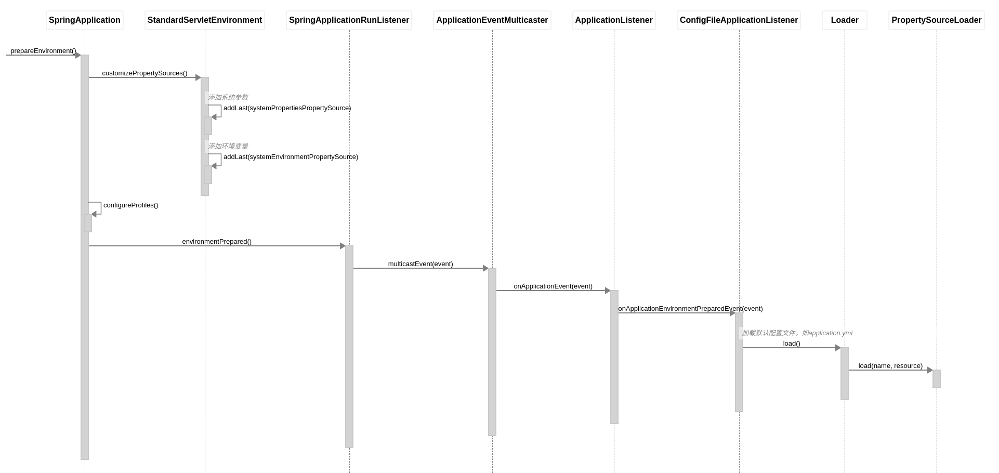
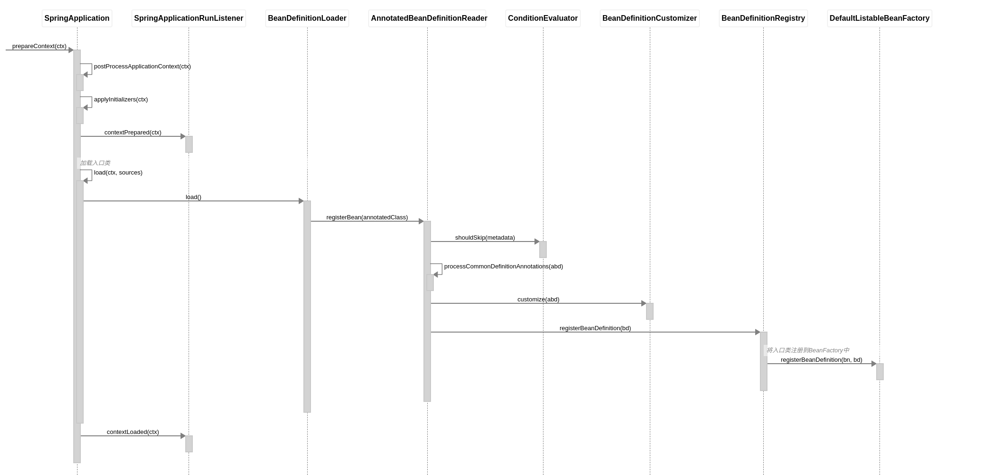
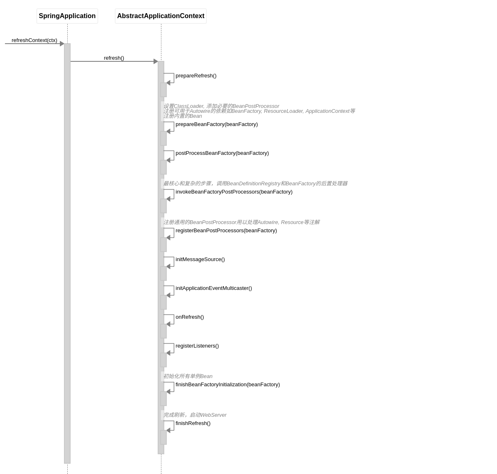

# 聊聊Spring框架

## 对Spring的一些印象

- 强大的IoC容器，非常方便的依赖注入

- 一切都是Bean

- 功能很全，干活很快，拿来主义=引JAR包+配置

- 很多接口，多到不知道干啥用的

## 随手写一个Web服务

```java
@SpringBootApplication
public class App {
    public static void main(String[] args) {
        SpringApplication.run(App.class, args);
    }
}

@RestController
class HelloController {
    @RequestMapping(value = "/hello")
    public ResponseEntity<String> hello() {
        return ResponseEntity.ok("hello, world");
    }
}
```

## 几个问题

1. 配置文件application.yml / application.properties 是通过什么方式加载的？有没有遇到过读不到配置的情况？

2. 依赖注入有几种方式？遇到过NPE么？遇到过循环依赖么？如何解决？

3. 定义Bean的方法是否可以用static关键字修饰？有什么不同？

4. BeanPostProcessor有什么用处？BeanFactoryPostProcessor有什么用处？

5. AutoConfiguration是通过什么机制进行自动配置的？@Conditional*注解是如何判定的？遇到过判定不符合预期的情况么？

6. HttpServletRequest和HttpServletResponse是通过什么方式注入到Controller的方法中的？

7. RestController里方法的返回类型是如何被识别并被转化为HttpResponse的？

8. Spring的事务处理是如何实现的？

9. 如何写一个Spring boot starter？

## 一个Spring应用的启动过程

- 完整运行

```groovy
App.main(args) {
  SpringApplication.run(App.class, args) {
    SpringApplicationRunListener.starting()
    prepareEnvironment()
    createApplicationContext()
    prepareContext(ctx)
    refreshContext(ctx)
    SpringApplicationRunListener.started()
    AppliationRunner.run(args)
    SpringApplicationRunListener.running()
  }
}
```


- 分解1：准备环境

```groovy
SpringApplication.prepareEnvironment() {
  StandardServletEnvironment.customizePropertySources() {
    addLast(systemPropertiesPropertySource)
    addLast(systemEnvironmentPropertySource)
  }
  configureProfiles()
  SpringApplicationRunListener.environmentPrepared() {
    ApplicationEventMulticaster.multicastEvent(event) {
      ApplicationListener.onApplicationEvent(event) {
        ConfigFileApplicationListener.onApplicationEnvironmentPreparedEvent(event) {
          Loader.load() {
            PropertySourceLoader.load(name, resource)
          }
        }
      }
    }
  }
}
```


- 分解2：创建AppCtx

```groovy
SpringApplication.createApplicationContext() {
  registerAnnotationConfigProcessors(registry) {
    registerPostProcessor(ConfigurationClassPostProcessor.class)
    registerPostProcessor(AutowiredAnnotationBeanPostProcessor.class)
    registerPostProcessor(RequiredAnnotationBeanPostProcessor.class)
    registerPostProcessor(CommonAnnotationBeanPostProcessor.class)
  }
}
```


- 分解3：准备AppCtx

```groovy
SpringApplication.prepareContext(ctx) {
  postProcessApplicationContext(ctx)
  applyInitializers(ctx)
  SpringApplicationRunListener.contextPrepared(ctx)
  load(ctx, sources) {
    BeanDefinitionLoader.load() {
      AnnotatedBeanDefinitionReader.registerBean(annotatedClass) {
        ConditionEvaluator.shouldSkip(metadata)
        processCommonDefinitionAnnotations(abd)
        BeanDefinitionCustomizer.customize(abd)
        BeanDefinitionRegistry.registerBeanDefinition(bd) {
          DefaultListableBeanFactory.registerBeanDefinition(bn, bd)
        }
      }
    }
  }
  SpringApplicationRunListener.contextLoaded(ctx)
}
```


- 分解4：刷新AppCtx

```groovy
SpringApplication.refreshContext(ctx) {
  AbstractApplicationContext.refresh() {
    prepareRefresh()
    prepareBeanFactory(beanFactory)
    postProcessBeanFactory(beanFactory)
    invokeBeanFactoryPostProcessors(beanFactory)
    registerBeanPostProcessors(beanFactory)
    initMessageSource()
    initApplicationEventMulticaster()
    onRefresh()
    registerListeners()
    finishBeanFactoryInitialization(beanFactory)
    finishRefresh()
  }
}
```


- 分解之分解：invokeBeanFactoryPostProcessors(beanFactory)

```groovy
AbstractApplicationContext.invokeBeanFactoryPostProcessors(beanFactory) {
  _invokeBeanDefinitionRegistryPostProcessor(beanFactory) {
    ConfigurationClassPostProcessor.postProcessBeanDefinitionRegistry(registry) {
      checkConfigurationClassCandidate(beanDef)
      ConfigurationClassParser.parse(candidates) {
        ConditionEvaluator.shouldSkip(metadata, phase)
        processMemberClasses(configClass, sourceClass) {
          may_processConfigurationClass(candidate)
        }
        processPropertySource(sourceClass)
        processComponentScan(sourceClass) {
          ComponentScanAnnotationParser.parse(componentScan) {
            findCandidateComponents(basePackage) {
              new SimpleMetadataReader(resource)
              isCandidateComponent(metadataReader)
            }
            _postProcessBeanDefinition(candidate, beanName)
            _processCommonDefinitionAnnotations(abd)
            checkCandidate(beanName, candidate)
            _registerBeanDefinition(definitionHolder, registry)
          }
          _parse(bdCand)
        }
        processImports(configClass, sourceClass) {
          _processImportSelector(candidate) {
            processImports(importClassNames)
          }
          _processImportBeanDefinitionRegistrar(candidate) {
            addImportBeanDefinitionRegistrar(configClass, registrar)
          }
          _processConfigurationClass(candidate)
        }
        _processImportResource(sourceClass)
        _processBeanMethods(sourceClass)
        _processInterfaces(configClass, sourceClass)
        _processSuperClass(sourceClass)
        
        processDeferredImportSelectors() {
          AutoConfigurationImportSelector.selectImports(annotationMetadata) {
            SpringFactoriesLoader.loadFactoryNames(EnableAutoConfiguration.class, classLoader)
          }
          processImports(configClass, sourceClass, importClassName)
        }
      }
      ConfigurationClassParser.validate()
      ConfigurationClassBeanDefinitionReader.loadBeanDefinitions(configClasses) {
        TrackedConditionEvaluator.shouldSkip(configClass)
        _registerBeanDefinitionForImportedConfigurationClass(configClass)
        loadBeanDefinitionsForBeanMethod(configClass.getBeanMethods())
        loadBeanDefinitionsFromImportedResources(configClass.getImportedResources())
        loadBeanDefinitionsFromRegistrars(configClass.getImportBeanDefinitionRegistrars())
      }
      _processUntilNoNewCandidates()
      _registerSingleton(importRegistry)
    }
    invokeBeanFactoryPostProcessors(registryProcessors, beanFactory) {
      ConfigurationClassPostProcessor.postProcessBeanFactory(beanFactory) {
        enhanceConfigurationClasses(beanFactory) {
          new ConfigurationClassEnhancer()
          _enhance(enhancer, configClass, beanClassLoader)
        }
        new ImportAwareBeanPostProcessor()
        _addBeanPostProcessor(beanFactory, importAwareBeanPostProcessor)
      }
    }
  }
  _invokeBeanFactoryPostProcessor(beanFactory) {
    PropertySourcesPlaceholderConfigurer.postProcessBeanFactory(beanFactory) {
      _addEnvironmentPropertySource()
      _addLocalPropertySource()
    }
  }
}
```


- 分解之分解：registerBeanPostProcessors

```groovy
AbstractApplicationContext.registerBeanPostProcessors(beanFactory) {
  registerBeanPostProcessor(beanFactory, ConfigurationPropertiesBindingPostProcessor)
  registerBeanPostProcessor(beanFactory, CommonAnnotationBeanPostProcessor)
  registerBeanPostProcessor(beanFactory, AutowiredAnnotationBeanPostProcessor)
  registerBeanPostProcessor(beanFactory, RequiredAnnotationBeanPostProcessor)
}
```


未完待续...

